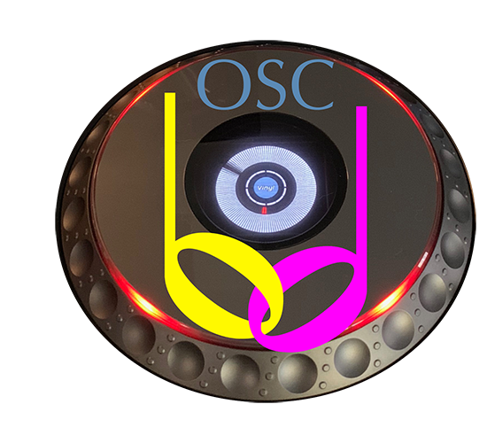

# open-beat-control

Provides a subset of
[beat-link](https://github.com/Deep-Symmetry/beat-link#beat-link)
features over [Open Sound
Control](https://en.wikipedia.org/wiki/Open_Sound_Control).

> :star2: This is the recommended replacement for the former
> standalone `beat-carabiner` daemon. That project is now embedded in
> this one as a library.

## Background

This project is intended for people who want to use the beat-link
library to integrate with Pioneer DJ equipment, but are running in a
non-JVM environment (like [PureData](https://puredata.info) or
[Max](https://cycling74.com/products/max/)), or who need to run a
lightweight headless process (that is, with no attached monitor,
keyboard, and mouse for the GUI) on something like a Raspberry Pi, and
thus are unable to take advantage of the features of [Beat Link
Trigger](https://github.com/Deep-Symmetry/beat-link-trigger#beat-link-trigger).

To begin with, only a few features were supported, but over time (and
based on interest and requests) more are being added when practical
approaches can be identified. The
[Carabiner](https://github.com/brunchboy/carabiner#carabiner)
integration previously provided by
[beat-carabiner](https://github.com/Deep-Symmetry/beat-carabiner#beat-carabiner)
was an early addition, and that project has become a library shared by
both this project and Beat Link Trigger itself, to solve the problem
of diverging features and stale code.

### Why OSC?

Open Sound Control is a strange protocol, and makes some aspects of
implementing an API awkward (there is no intrinsic support for
requests with responses), but it is widely supported in the kind of
experimental music environments that are most likely to benefit from a
project like this.

## Installation

Install a Java runtime, and the latest `open-beat-control.jar` from
the
[releases](https://github.com/Deep-Symmetry/open-beat-control/releases)
page, on your target hardware.

### Java Runtime

The minimum Java version needed is 9, but a current release will
perform better and have more recent security updates. We currently use
[Amazon Corretto
11](https://docs.aws.amazon.com/corretto/latest/corretto-11-ug/downloads-list.html)
which is a free OpenJDK 11 distribution with long-term support.

If you are using Open Beat Control on a Raspberry Pi, we have not yet
started testing this (and very much would like to hear reports from
people who have), but it looks like [Raspbian
Buster](https://www.raspberrypi.org/downloads/raspbian/) includes
OpenJDK 11 as well, so it should be a great starting point.

## Usage

You can either start open-beat-control manually when you want to use
it, or configure it to start when your system boots.

To start open-beat-control manually, run:

    java -jar open-beat-control.jar

It will log to the terminal window in which you are running it.

> :wrench: You will see warnings about "illegal reflective access
> operations." This is normal and currently unavoidable, because
> several of the libraries used by Beat Link Trigger have not been
> updated to be compatible with the Java Module System introduced in
> Java 9. That may never happen; modules radically changed the rules,
> and the "future release" where these rules are enforced may never
> come.

If you instead want to run it at system startup, you will probably
also want to set a log-file path, so it logs to a rotated log file in
your standard system logs directory, something like:

    java -jar open-beat-control.jar -L /var/log/open-beat-control.log

Other options allow you to adjust many aspects of its behavior, and
there will likely be more to come.

### Options

    -o, --osc-port PORT        17002  Port number for OSC server
    -r, --real-player                 Try to pose as a real CDJ (device #1-4)
    -d, --device-number NUM           Use fixed device # (overrides -r)
    -B, --bridge                      Use Carabiner to bridge to Ableton Link
    -a, --ableton-master              When bridging, Ableton Link tempo wins
    -b, --beat-align                  When bridging, sync to beats only, not bars
    -c, --carabiner-port PORT  17000  When bridging, port # of Carabiner daemon
    -l, --latency MS           20     How many milliseconds are we behind the CDJs
    -L, --log-file PATH               Log to a rotated file instead of stdout
    -h, --help                        Display help information and exit

For more information about these, please see the [User
Guide](https://obc-guide.deepsymmetry.org/open-beat-control/readme#startup)

## User Guide

To learn how to communicate with Open Beat Control, and the OSC
messages you can send and receive, please see the
[User Guide :book:](https://obc-guide.deepsymmetry.org/).

### Community

For the moment, discussion of Open Beat Control is taking place on
[Beat Link Trigger's Zulip
stream](https://deep-symmetry.zulipchat.com/#narrow/stream/275322-beat-link-trigger).
If enough people start using it and discussing issues that aren't
interesting to Beat Link Trigger users, I will create a separate
stream.

## Funding

Open Beat Control is, and will remain, completely free and
open-source. If it has helped you, taught you something, or pleased
you, let us know and share some of your discoveries and code as
described above. If you&rsquo;d like to financially support its
ongoing development, you are welcome (but by no means obligated) to
donate to offset the hundreds of hours of research, development, and
writing that have already been invested. Or perhaps to facilitate
future efforts, tools, toys, and time to explore.

 using Liberapay, or
 using PayPal

## Compatibility

This is in no way a sanctioned implementation of the protocols. It should be clear, but:

> :warning: Use at your own risk! For example, there are reports that
> the XDJ-RX (and XDJ-RX2) crash when Beat Link starts, so don&rsquo;t
> use it with one on your network. As Pioneer themselves
> [explain](https://forums.pioneerdj.com/hc/en-us/community/posts/203113059-xdj-rx-as-single-deck-on-pro-dj-link-),
> the XDJ-RX does not actually implement the protocol:
>
> &ldquo;The LINK on the RX [and RX2] is ONLY for linking to rekordbox
> on your computer or a router with WiFi to connect rekordbox mobile.
> It can not exchange LINK data with other CDJs or DJMs.&rdquo;

While these techniques appear to work for us so far, there are many
gaps in our knowledge, and things could change at any time with new
releases of hardware or even firmware updates from Pioneer.

You should also not expect to be able to run Open Beat Control, or any
project like it, on the same machine that you are running rekordbox,
because they will compete over access to network ports.

Open Beat Control seems to work great with CDJ-2000 Nexus gear, and
works fairly well (with less information available) with older
CDJ-2000s. It has also been reported to work with XDJ-1000 gear. If
you can try it with anything else, *please* let us know what you learn
in the [Beat Link Trigger Zulip
stream](https://deep-symmetry.zulipchat.com/#narrow/stream/275322-beat-link-trigger),
or if you have worked out actionable details about something that
could be improved, [open an
Issue](https://github.com/Deep-Symmetry/open-beat-control/issues) or
submit a pull request so we can all improve our understanding
together.

If something isn&rsquo;t working with your hardware and you don&rsquo;t yet know
the details why, but are willing to learn a little and help figure it
out, look at the
[dysentery project](https://github.com/Deep-Symmetry/dysentery#dysentery),
which is where we are organizing the research tools and results which
made programs like Open Beat Control possible.

## Startup Issues

If you downloaded the `.jar` version and are using a recent Java
distribution, double-clicking doesn&rsquo;t open up the application,
so open a terminal window and run it from the command line:

    java -jar open-beat-control.jar

If that does not work, at least you will be able to see a detailed
report of what went wrong, which can help you troubleshoot the issue.

Make sure you have a current OpenJDK distribution installed (we build
releases with [Amazon Corretto
11](https://docs.aws.amazon.com/corretto/latest/corretto-11-ug/downloads-list.html)).

## Licenses

Copyright © 2019–2022 [Deep Symmetry, LLC](https://deepsymmetry.org)

Distributed under the Eclipse Public License either version 2.0 or (at
your option) any later version. By using this software in any fashion,
you are agreeing to be bound by the terms of this license. You must
not remove this notice, or any other, from this software.

### Library Licenses

#### [Remote Tea](https://sourceforge.net/projects/remotetea/)

Used for communicating with the NFSv2 servers on players, licensed
 under the [GNU Library General Public License, version
 2](https://opensource.org/licenses/LGPL-2.0).

#### The [Kaitai Struct](http://kaitai.io) Java runtime

Used for parsing rekordbox exports and media analysis files, licensed
under the [MIT License](https://opensource.org/licenses/MIT).

#### [Antora](https://antora.org)

Used to build the [user guide](https://obc-guide.deepsymmetry.org/),
for embedding inside the application, and hosting on
[Netlify](https://www.netlify.com). Antora is licensed under the
[Mozilla Public License Version
2.0](https://www.mozilla.org/en-US/MPL/2.0/) (MPL-2.0).
